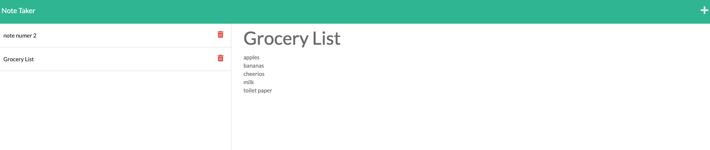

# Note Taker App

## Description
  This application presents the user with the ability to add a note with a title and a note text and save. The new note is saved to a “database” file which will be loaded upon launching the app. The user can click on a previously saved note to view the note, and use the trash can icon to delete a specific note in the list.

## Table of Contents
- [Installation](#installation)
- [Usage](#usage)
- [License](#license)
- [Contributing](#contributing)
- [Tests](#tests)
- [Questions](#questions)

## Installation
To install, download the repository files and run ```npm i``` in the terminal from the root folder to install all dependencies (Express in this case).

## Usage
To use locally, comment out line 6 and comment back in line 7 (the const PORT lines). Then run ```node server.js``` in the terminal. The local address will be presented by express in the terminal. Access that link to launch the application in your browser. To use the version hosted on Heroku, simply go to [https://morning-beyond-36687.herokuapp.com/notes] in your browser.


## License
  [](https://opensource.org/licenses/MIT)

Copyright 2021 Mathew Lundin

Permission is hereby granted, free of charge, to any person obtaining a copy of this software and associated documentation files (the "Software"), to deal in the Software without restriction, including without limitation the rights to use, copy, modify, merge, publish, distribute, sublicense, and/or sell copies of the Software, and to permit persons to whom the Software is furnished to do so, subject to the following conditions:

The above copyright notice and this permission notice shall be included in all copies or substantial portions of the Software.

THE SOFTWARE IS PROVIDED "AS IS", WITHOUT WARRANTY OF ANY KIND, EXPRESS OR IMPLIED, INCLUDING BUT NOT LIMITED TO THE WARRANTIES OF MERCHANTABILITY, FITNESS FOR A PARTICULAR PURPOSE AND NONINFRINGEMENT. IN NO EVENT SHALL THE AUTHORS OR COPYRIGHT HOLDERS BE LIABLE FOR ANY CLAIM, DAMAGES OR OTHER LIABILITY, WHETHER IN AN ACTION OF CONTRACT, TORT OR OTHERWISE, ARISING FROM, OUT OF OR IN CONNECTION WITH THE SOFTWARE OR THE USE OR OTHER DEALINGS IN THE SOFTWARE.

  [MIT License](https://opensource.org/licenses/MIT)
    

## Contributing
The front end of this application was provided by the UT Austin coding bootcamp for a homework assignment. Mat Lundin configured the backend technology.

## Tests
No tests have been built for this application.

## Questions
Any questions can be submitted to the developer via GitHub.


You can access this repository [here.](https://github.com/mat-lundin/Homework-11-Note-Taker)

